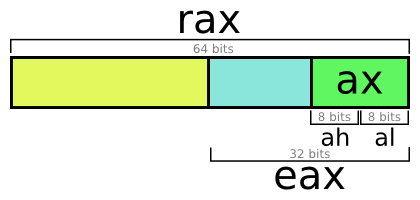

Na azért atmegyek az alapokon is csak hogy teljes legyen.
(Előre is sorry nincs hosszú i a laptopomon xd)

Az assembly a gépi kód aka nullák és eggyesek egy dialektusa. Avagy gyakorlatilag nem kell forditani eggyiket a masikra - ezt úgy is szoktak mondani hogy 1 az 1hez aranyulnak.

Az assemblyt két felé képpen tudod leírni mindkettő ugyan az csak az eggyik érthetőbb az embereknek. Az eggyok a hexadecimalis bytokkal (pl E9 DE AD BE EF) a másik pedig a szöveges (pl mov eax, [edi])

Az assembly és ezaltal a gépi kód is minden procin más. Manapság a számítógépekben hasznalt assemblyk elég hasonlóak de minden procival jön egy két új utasítás.

Amit mi fogunk tanul az az Intel x86 és Intel x64
És ha nem felejtem el majd azért megemlitem az amd és arm eseket is. Szerencsekre az inteles a legatlathatobb.

Igyekszem most csak a szükséges dolgokat leírni.
# Registerek
## General Purpose
a,b,c,d,source,destination,stack pointer,base pointer.
Ezeknek a mérete 32 vagy 64 bit attól függően hogy hány bites a processzorod.

Nem mindig van szükségünk egy egész registerre ezért mindeggyik register részekre van bontva. Például most vegyük az A registert.


És akkor mégegyszer a registerek ahogy általában látod őket, plusz hogy mit csinálnak. (amihez nem irok semmit azt gyakorlatilag arra használod mindig amire épp kell)

EAX - Ebben a registerben van a **return** értéke a meghivott funkciónak. 
EBX 
ECX
EDX
ESI - Source pointer      
EDI - Destination pointer,  az  esivel eggyüt szokás használni pédául két memória swapolására , ezekbe is szeretnek passolni argumentumokat a funkciók
ESP - Stack pointer, Megmutatja hogy épp hol vagyunk a stacken de át lehet irni
EBP - **Mindig** az adott funkcio kezdő cime van benen , gyakorlatilag nem is lenne erre szükség de egyszerűsiti a debuggolást

ezen felül szokott lenni még
R7-től egészen R15-ig 8db extra register arra hsaználod őket amire szeretnéd. Többet nem esik róluk szó ,nem olyan fontosak.

## FLAGS

EFLAGS 32 biten

Minden bitjének saját jelentése van és a különböző utasitások hatására változik az értékük.
Nem olyan fontos ezeket se tudni majd ha eljutunk a CMP ig akkor lesz néha érdekes.

De csak a példa kedvéért

```S
mov eax,1    ; eax ba rakunk 1 et
sub eax,1    ; kivonunk eax értékéből eggyet
jz UGRO_CIM  ;jump zero instrukcio akkor ugrik ha a zero flag be van nyomva

```


